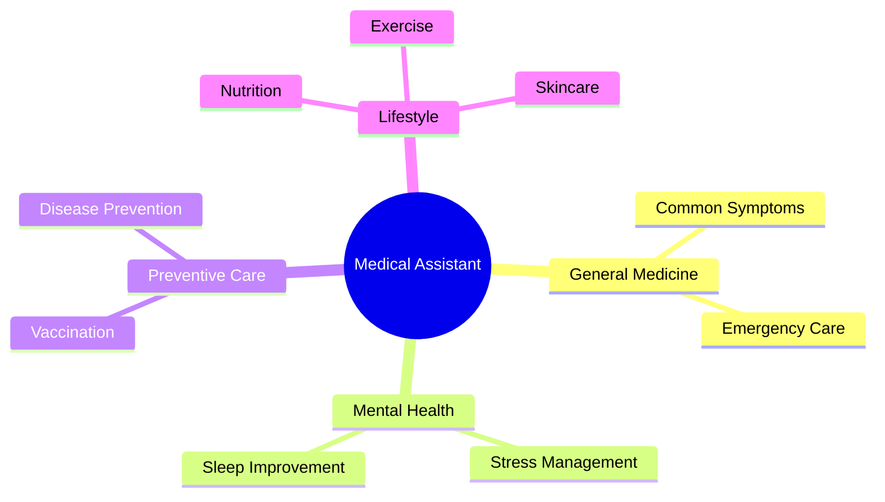
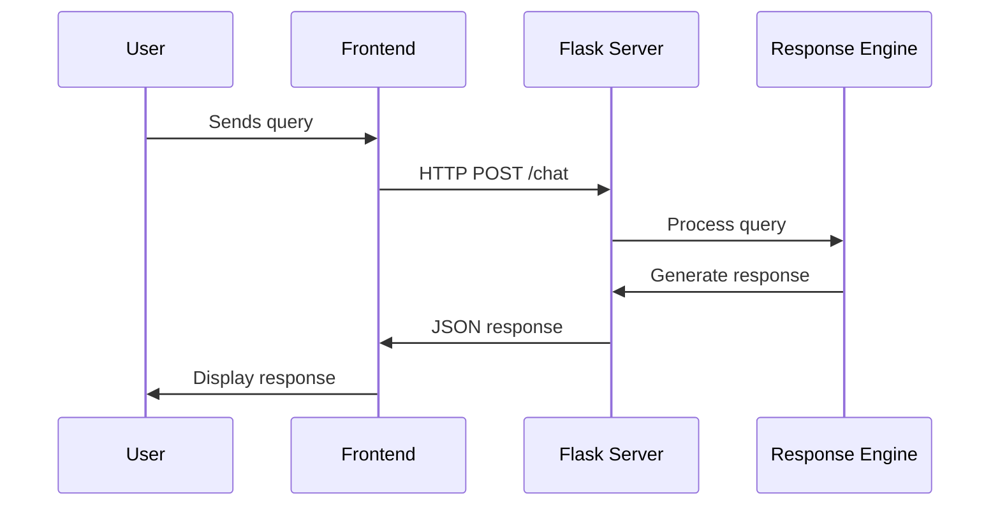

# 🤖 Medical Assistant Chatbot

<div align="center">
  
  
  
  
  
</div>

<p align="center">
  <h2 align="center">AI-Powered Medical Assistant Chatbot</h2>
  <p align="center">An intelligent chatbot system providing medical information and health guidance in Persian</p>
</p>

<div align="center">
  
  [](LICENSE)
  [](https://www.python.org/downloads/)
  [](https://flask.palletsprojects.com/)
  
</div>

## 📚 Table of Contents
- [Features](#-features)
- [System Architecture](#-system-architecture)
- [Installation](#-installation)
- [Usage](#-usage)
- [API Documentation](#-api-documentation)
- [Security](#-security)
- [Contributing](#-contributing)

## ✨ Features

### Medical Categories


### Key Functionalities
- 🏥 Medical consultation in multiple specialties
- 💊 Drug information and guidance
- 🥗 Nutrition and diet recommendations
- 🧘‍♀️ Mental health support
- 💉 Vaccination information
- 🏃‍♂️ Exercise and fitness tips

## 🏗 System Architecture



## 💻 Installation

### Prerequisites
```bash
# Required Software
- Python 3.7+
- pip
- virtualenv
```

### Setup
```bash
# Clone repository
git clone https://github.com/Awrsha/medical-chatbot.git
cd medical-chatbot

# Create virtual environment
python -m venv venv
source venv/bin/activate  # Linux/Mac
.\venv\Scripts\activate  # Windows

# Install dependencies
pip install -r requirements.txt
```

### Project Structure
```
medical-chatbot/
├── app.py                 # Main Flask application
├── secret.py             # Security configurations
├── static/
│   ├── css/
│   └── js/
├── templates/
│   └── index.html
└── responses/
    └── medical_data.json
```

## 🚀 Usage

### Starting the Server
```bash
python app.py
```

### API Endpoints
| Endpoint | Method | Description |
|----------|---------|------------|
| `/` | GET | Serves main chat interface |
| `/chat` | POST | Handles chat messages |
| `/category` | POST | Returns category-specific responses |

## 📝 API Documentation

### Chat Endpoint
```javascript
POST /chat
{
    "message": "علائم سرماخوردگی چیست؟"
}

Response:
{
    "response": "سردرد، تب و گلودرد از علائم شایع سرماخوردگی هستند."
}
```

### Category Endpoint
```javascript
POST /category
{
    "category": "تغذیه سالم"
}

Response:
{
    "response": "مصرف میوه و سبزیجات را افزایش دهید."
}
```

## 🔒 Security

### Features
- Secret key generation using `secrets` module
- CSRF protection
- Input sanitization
- Rate limiting

### Security Code Example
```python
import secrets
secret_key = secrets.token_hex(16)
```

## 🤝 Contributing

Contributions are welcome! Please read our [Contributing Guidelines](CONTRIBUTING.md).

### Development Workflow
1. Fork the repository
2. Create a feature branch
3. Make your changes
4. Submit a pull request

## 📄 License

This project is licensed under the MIT License - see the [LICENSE](LICENSE) file for details.
